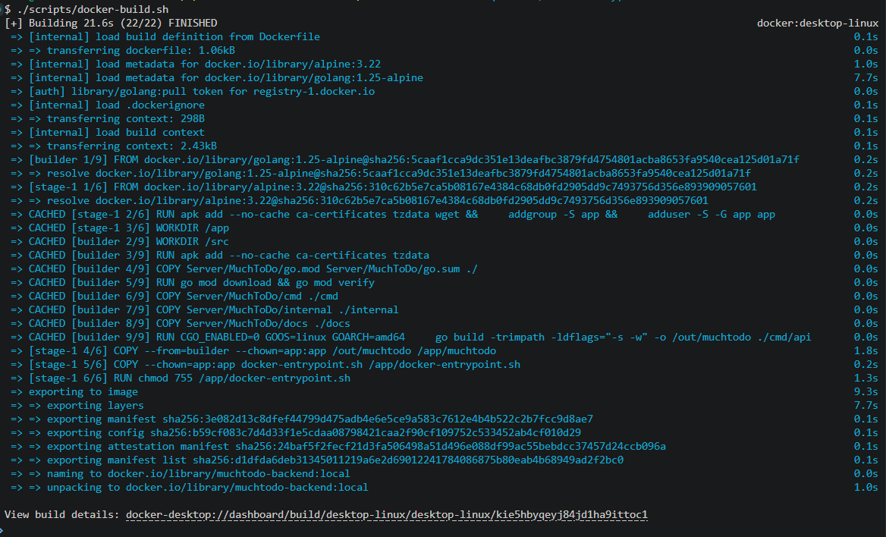
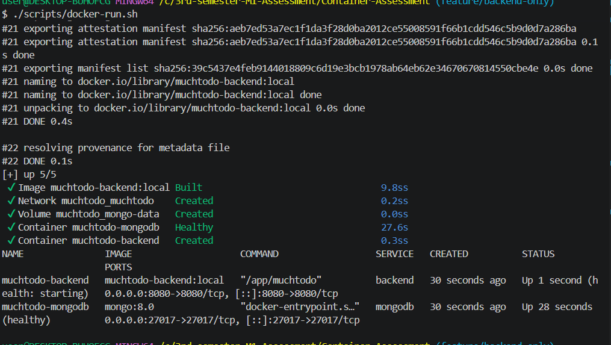
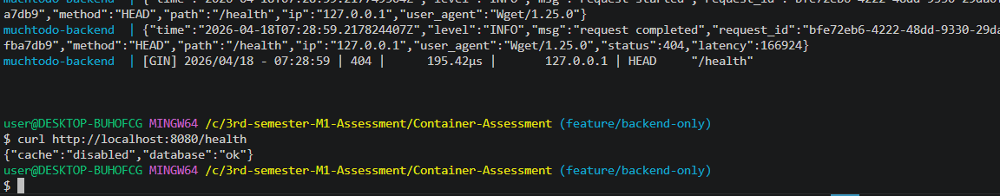
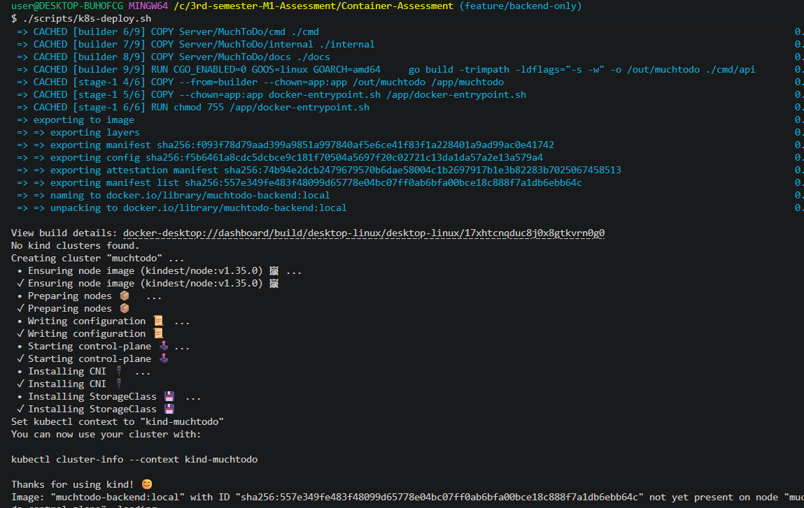
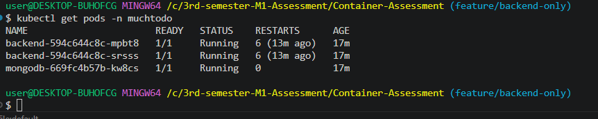
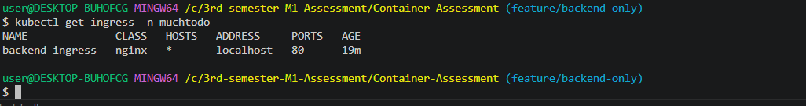
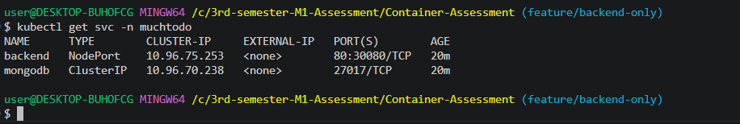
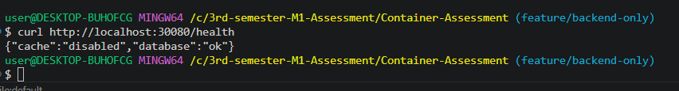
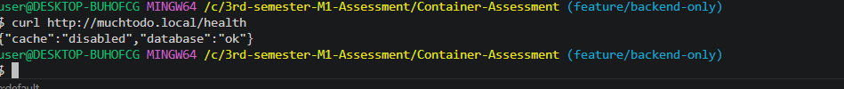
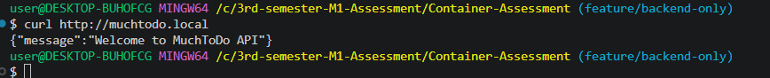

# Open Container Assessment Folder

 This repository contains the containerization and local Kubernetes deployment setup for the existing MuchToDo backend application inside Server folder.

---
## Deployment Evidence

Below are the screenshots confirming the successful build and orchestration of the MuchToDo application.

### Docker & Compose
* **Build Success:** 
* **Compose Up:** 
* **Health Check:** 

### Kubernetes (Kind)
* **Cluster Created:** 
* **Pods Status:** 
* **Ingress Setup:** 
* **Services:** 
* **NodePort Access:** 

### Application Health & Access
* **Health Endpoint:** 
* **Browser Access:** 
